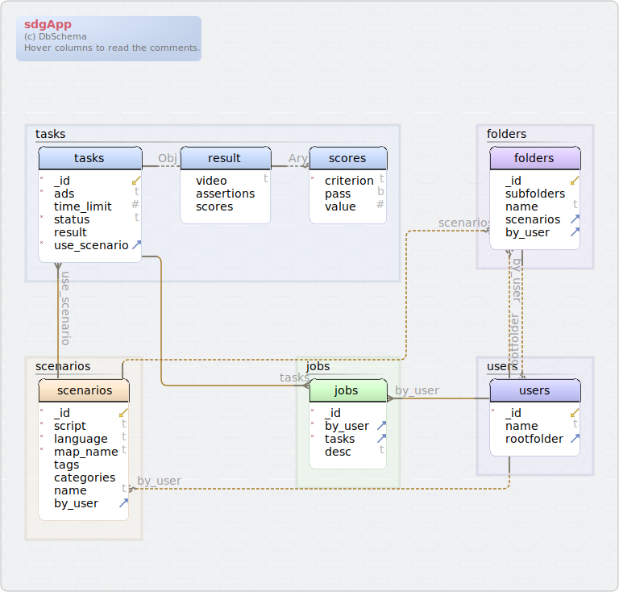

#sdgApp
Generated using [DbSchema](https://dbschema.com)

### DB Design

### Collection folders 
| Idx | Field Name | Data Type |
|---|---|---|
| ⬋ | <a name='sdgApp.folders__id'>&#95;id</a>| oid  |
|  | <a name='sdgApp.folders_subfolders'>subfolders</a>| array&#91;string&#93;  |
|  | <a name='sdgApp.folders_name'>name</a>| string  |
| ⬈ | <a name='sdgApp.folders_scenarios'>scenarios</a>| array&#91;string&#93;  |
| ⬈ | <a name='sdgApp.folders_by_user'>by&#95;user</a>| oid  |
| Virtual Relations |
| Vir | Fk_folders_users | ( by&#95;user ) ref [sdgApp&#46;users](#users) (&#95;id) |
| Vir | Fk_folders_scenarios | ( scenarios ) ref [sdgApp&#46;scenarios](#scenarios) (&#95;id) |

### Collection jobs 
| Idx | Field Name | Data Type |
|---|---|---|
| *| <a name='sdgApp.jobs__id'>&#95;id</a>| oid  |
| *⬈ | <a name='sdgApp.jobs_by_user'>by&#95;user</a>| oid  |
| *⬈ | <a name='sdgApp.jobs_tasks'>tasks</a>| array&#91;object&#93;  |
|  | <a name='sdgApp.jobs_desc'>desc</a>| string  |
| Virtual Relations |
| Vir | Fk_job_user | ( by&#95;user ) ref [sdgApp&#46;users](#users) (&#95;id) |
| Vir | Fk_job_task | ( tasks ) ref [sdgApp&#46;tasks](#tasks) (&#95;id) |

### Collection scenarios 
| Idx | Field Name | Data Type |
|---|---|---|
| *⬋ | <a name='sdgApp.scenarios__id'>&#95;id</a>| oid  |
| *| <a name='sdgApp.scenarios_script'>script</a>| string  |
| *| <a name='sdgApp.scenarios_language'>language</a>| enum&#40;&#39;cartel&#39;&#44;&#39;scenic&#39;&#41;  DEFAULT 'cartel' |
| *| <a name='sdgApp.scenarios_map_name'>map&#95;name</a>| string  DEFAULT 'Town03' |
|  | <a name='sdgApp.scenarios_tags'>tags</a>| array&#91;string&#93;  |
|  | <a name='sdgApp.scenarios_categories'>categories</a>| array&#91;string&#93;  |
|  | <a name='sdgApp.scenarios_name'>name</a>| string  |
| ⬈ | <a name='sdgApp.scenarios_by_user'>by&#95;user</a>| oid  |
| Virtual Relations |
| Vir | Fk_scenarios_users | ( by&#95;user ) ref [sdgApp&#46;users](#users) (&#95;id) |

### Collection tasks 
| Idx | Field Name | Data Type | Description |
|---|---|---|---|
| *⬋ | <a name='sdgApp.tasks__id'>&#95;id</a>| oid  |  |
| *| <a name='sdgApp.tasks_ads'>ads</a>| enum&#40;&#39;autoware&#39;&#44; &#39;pylot&#39;&#41;  DEFAULT 'autoware' | the ads name |
|  | <a name='sdgApp.tasks_time_limit'>time&#95;limit</a>| int  DEFAULT -1 | time limit by seconds |
| *| <a name='sdgApp.tasks_status'>status</a>| enum&#40;&#39;Ready&#39;&#44; &#39;Running&#39;&#44; &#39;Done&#39;&#41;  DEFAULT 'Ready' | progress |
|  | <a name='sdgApp.tasks_result'>result</a>| object  |  |
|  | <a name='sdgApp.tasks_result.video'>result&#46;video</a>| string  | url of video |
|  | <a name='sdgApp.tasks_result.assertions'>result&#46;assertions</a>| array&#91;object&#93;  | a list of assertion result |
|  | <a name='sdgApp.tasks_result.scores'>result&#46;scores</a>| array&#91;object&#93;  |  |
| *| <a name='sdgApp.tasks_result.scores.criterion'>result&#46;scores&#46;criterion</a>| string  |  |
|  | <a name='sdgApp.tasks_result.scores.pass'>result&#46;scores&#46;pass</a>| bool  DEFAULT 0 |  |
|  | <a name='sdgApp.tasks_result.scores.value'>result&#46;scores&#46;value</a>| double  |  |
| *⬈ | <a name='sdgApp.tasks_use_scenario'>use&#95;scenario</a>| oid  |  |
| Virtual Relations |
| Vir | Fk_task_scenario | ( use&#95;scenario ) ref [sdgApp&#46;scenarios](#scenarios) (&#95;id) |  |

### Collection users 
| Idx | Field Name | Data Type |
|---|---|---|
| *⬋ | <a name='sdgApp.users__id'>&#95;id</a>| oid  |
|  | <a name='sdgApp.users_name'>name</a>| string  |
| ⬈ | <a name='sdgApp.users_rootfolder'>rootfolder</a>| oid  |
| Virtual Relations |
| Vir | Fk_users_folders | ( rootfolder ) ref [sdgApp&#46;folders](#folders) (&#95;id) |

